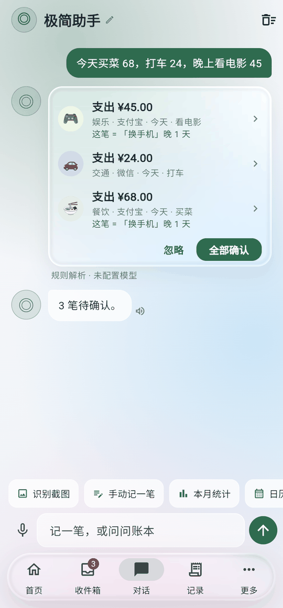
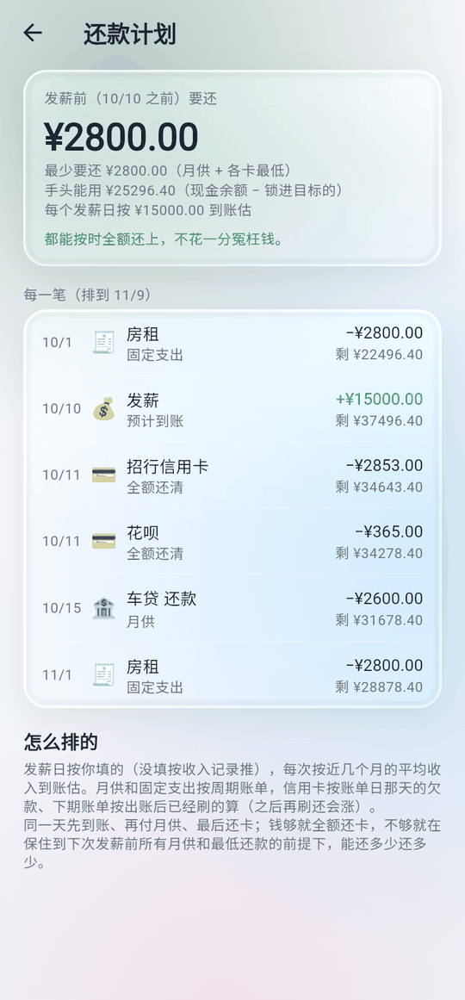
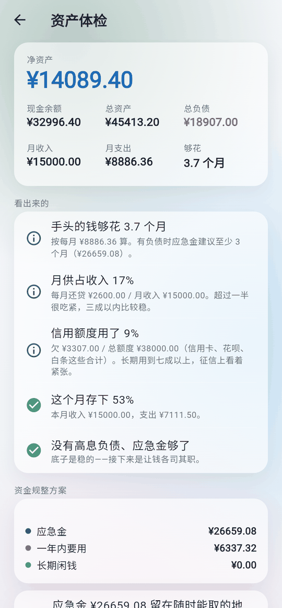

# 余见 Yujian

[](https://github.com/Hector-xue/yujian/releases)
[](https://github.com/Hector-xue/yujian/releases/latest)
[](https://github.com/Hector-xue/yujian/stargazers)
[](LICENSE)


**本地运行的 AI 记账 App**：说一句话记一笔，付完款自动记上，把「可花的」「够花几个月」「这个月怎么还款」算清楚给你看。开源、免费、没有广告。

<p align="center">
  
  
  
  
</p>

## 下载

- **Android**：[最新版 APK](https://github.com/Hector-xue/yujian/releases/latest)（arm64 适合绝大多数手机，老机型选 arm32）
- **Windows / Linux / Web**：同一个 [Release 页](https://github.com/Hector-xue/yujian/releases/latest)
- 官网：[yujian.ivyea.com](https://yujian.ivyea.com/)（国内下载更快，含教程和更新日志）

## 能做什么

- **说一句话就记上**：「今天买菜 68，打车 24，看电影 45」三笔一次记好，自动分类、认账户、补时间；不配模型也能用本机规则记。
- **自动记账**：微信 / 支付宝 / 银行的支付通知、支付成功页、账单截图，都在本机识别后记上。
- **可花的，而不是余额**：扣掉目标锁仓、发薪前要付的账单和信用卡欠款，才是真正能花的钱；再按到发薪日的天数算「今天还能花」。
- **负债与信用卡**：房贷、车贷、网贷，信用卡、花呗、分付、白条、抖音月付；按账单日 / 还款日算本期账单、最低还款、利息和违约金，日历上标出每个还款日。
- **还款计划与资产体检**：按发薪日和各个还款日排出每一笔怎么还；给出资产状况和按先后排好的调优方案，不缺钱的给资金规整建议。
- **问账本**：「这个月外卖花了多少」——在账本上查出来并给出依据，不是模型凭印象报数。
- **目标与财富游戏**：换手机、买车、首付、旅行，存入是真转账；称号、周任务、成就都由账本事实触发。
- **人格与主题**：极简助手、猫娘、财务教练……或者自己写；12 套主题（含 3 套深色），可跟随系统。

## 隐私与安全

**本地运行的单机记账：不用注册，账本不上云，没有广告和统计。**
大模型和云端语音都是可选的，要用得你自己配置，发送前卡号、手机号等先打码；除此之外只有检查更新和你主动发的反馈会联网，每一次都记在「出网记录」里。源码公开，可以逐行核对，放心授权。

- **权限只为本机识别**：通知 / 无障碍 / 相册只用来在本机认出支付记录，内容不出手机；不给也能手动记。
- **一键断网**：打开「纯本地模式」，所有联网路径全部关闭，记账、统计照常。
- **完整说明**：App 内 更多 → 隐私声明（按代码里每一条出网路径写）。

## 交流与反馈

App 里 更多 → 关于 → 反馈，可以直接带截图发给作者；也欢迎扫码进群，反馈 Bug、交流记账和理财心得、提改进建议，或到 GitHub 提 [Issue](https://github.com/Hector-xue/yujian/issues) / PR。群二维码可能会过期；如果扫码失效，可先关注公众号，再获取最新群二维码。

<table>
  <tr>
    <td align="center" width="50%">
      
      <br />
      <strong>微信群：Ivyea 的精神股东们</strong>
      <br />
      <sub>反馈 Bug / 交流使用心得 / 提改进建议</sub>
    </td>
    <td align="center" width="50%">
      
      <br />
      <strong>公众号</strong>
      <br />
      <sub>群二维码失效时，关注后获取最新版</sub>
    </td>
  </tr>
</table>

---

以下是开发相关内容。

## 设计原则

- **AI 负责理解，账本核心负责事实，用户负责授权。** 模型只能提议（`propose`），提交（`commit`）由用户在收件箱完成。
- **Local-first。** 账本核心是一个纯 Dart 包，随 App 运行；服务端是可选外围（同步 / 备份 / MCP）。
- **BYOM。** OpenAI-compatible、Anthropic、Ollama、Gemini，能力按模型实测，不按厂商猜。
- **人格只改语气。** 触不到金额、时间、余额、权限与确认流程。陪聊时它只能引用 App 给的几行汇总数字，记住的事只存本机、可删。
- **把真钱做成游戏币，不造假币。** 目标（换手机 / 买车 / 首付 / 旅行）绑定真实的锁仓账户，存入是真转账、兑现是真支出；首页显示的是「可花的」和「今天还能花」，等级 = 生存月数，成就由账本事实触发。没有虚拟币、积分商店、签到。
- **每一次出网都有记录，且可以一键全关。** 会联网的只有：你自己配的模型 / 语音服务、检查更新、你主动发送的反馈。App 内「出网记录」逐条写明发了什么、发给谁、多少 token，并附大白话解释；「纯本地模式」一键禁掉所有出网路径，只用本机识别 + 本机规则。完整隐私声明在 更多 → 隐私。
- **自动记账两条路都要你在系统里显式授权。** 通知监听只读支付类通知；支付页识别（无障碍）只看名单 App 的「支付成功」页，读到的内容不出本机。

## 仓库结构

```
packages/ledger_core   账本核心：账户 / 交易 + posting 轻复式 / 草稿收件箱 / 审计 / 完整性校验
packages/interpreter   自然语言 → 草稿 / 查询 / 修改意图（规则优先，LLM 兜底，可插拔）
packages/query_dsl     查询 DSL（模型只出 JSON，引擎在账本上执行并给依据）
packages/providers     模型 Provider 抽象、OpenAI-compatible 实现、能力实测
packages/persona       人格包：五段分层提示词，人格只能改风格段；陪聊层（CompanionReplier）+ 记忆
packages/notification_templates  支付类通知 → 金额/方向/商户（Android 自动记账用）
packages/mcp_server    MCP Server（stdio）：只读 + propose 工具，给任何 agent 用
apps/yujian            Flutter App                                  [Phase 1]
server/                可选 Python 服务端                            [Phase 3]
corpus/                解析语料
personas/              人格包
```

## 开发

需要 Dart SDK ≥ 3.6（Phase 0 不需要 Flutter）。

```bash
scripts/check.sh          # 分析 + 全部纯 Dart 测试 + 语料回归（rule），CI 跑的就是它

# 语料回归（rule 不需要模型；llm / hybrid 需要 OpenAI-compatible 端点）
cd packages/interpreter
dart run bin/corpus_eval.dart --mode rule
YUJIAN_LLM_BASE_URL=https://api.deepseek.com/v1 YUJIAN_LLM_API_KEY=sk-... YUJIAN_LLM_MODEL=deepseek-chat \
  dart run bin/corpus_eval.dart --mode hybrid

# Phase 0 验收命令行：一句话 → 草稿 → y 确认 → 查询
dart run bin/yujian_cli.dart --db yujian.db
```

Flutter App（`apps/yujian`）不在本机构建：GitHub Actions 负责 analyze / test / build，产物在 Actions 页面下载。

## 解析管线

```
文本 → RuleInterpreter（金额/日期/类型/分类/账户，<10ms）
        ├─ 完整且置信 ≥ 0.8 → 草稿
        └─ 否则 → LLMInterpreter（结构化 JSON，只能用给定的账户/分类 id）
                   ├─ 金额与文本数字交叉核对，不一致降置信
                   └─ 模型不可用 → 退回规则结果，标 degraded
草稿 → ledger_core 校验 → 收件箱 → 用户确认 → 落账
```

查询不依赖 tool calling：模型只输出 Query DSL JSON，`query_dsl` 校验后在账本上执行，返回行 + 依据交易 id。

## 账本核心速览

```dart
final db = openLedgerDatabase('yujian.db');
final ledger = Ledger(db)..seedDefaultCategories();
final wechat = ledger.createAccount(name: '微信', type: AccountType.eWallet, currency: 'CNY');

// 模型 / 规则 / 通知只能走这里
final drafts = ledger.propose([
  DraftInput(payload: {
    'type': 'expense', 'amount_minor': 2800, 'currency': 'CNY',
    'account_id': wechat.id, 'category_id': 'food',
    'occurred_at': '2026-09-15T12:30:00+08:00', 'description': '午餐',
  }),
], source: Source.chat, interpreter: 'hybrid', modelUsed: 'deepseek-chat');

// 用户在收件箱确认；幂等，可带修改
final tx = ledger.commit(drafts.single.id, edits: {'category_id': 'transport'});
ledger.balance(wechat.id);      // 由流水推导，不落库
ledger.auditFor(tx.id);         // propose → commit → create 全链
```

金额一律最小货币单位整数；时间带偏移存储；交易由 type 决定 posting 结构（expense 一负、income 一正、transfer 一负一正和为零、refund 挂原交易且不超余额、adjustment 必填原因）。

## MCP

Release 里有 `yujian-mcp-<版本>-<平台>` 包（`bin/yujian_mcp` + `lib/libsqlite3`），或自己构建：

```bash
cd packages/mcp_server && dart build cli --target bin/yujian_mcp.dart -o build/mcp
build/mcp/bundle/bin/yujian_mcp --db <余见的 yujian.db 路径>   # 路径在 App「更多」页底部
```

注意别用 `dart run` 起 MCP server：它会往 stdout 打 "Running build hooks..."，破坏 JSON-RPC。

Claude Desktop / ivyea-agent 等把它配成 stdio server 即可。工具只有查询和 `propose_*`：agent 提议的交易进收件箱，用户在 App 里确认后才入账。

## 发布

`git tag v0.1.0 && git push --tags` → `release` 工作流构建签名 apk 与 web 包并挂到 GitHub Release。签名 keystore 不在仓库里，CI 从 Secret 还原；缺 Secret 直接失败。

文档：[更新日志](CHANGELOG.md) · [路线图](docs/ROADMAP.md) · [隐私说明](docs/PRIVACY.md)

## 许可证

[AGPL-3.0](LICENSE) © 2026 Hector

可以自由使用、修改、分发；修改后对外提供服务（含网络服务）须以同一协议公开源码。

---

## ☕ 请作者喝杯咖啡

余见一直是免费开源的。如果它帮你把钱看清楚了，欢迎请作者喝杯咖啡——你的支持是我持续更新的动力，也是对这个项目的认可。当然，点个 Star，同样是很大的支持。

<table>
  <tr>
    <td align="center">
      
      <br />
      <strong>微信扫码 · 支持作者</strong>
      <br />
      <sub>金额随意，心意都收到了</sub>
    </td>
  </tr>
</table>
